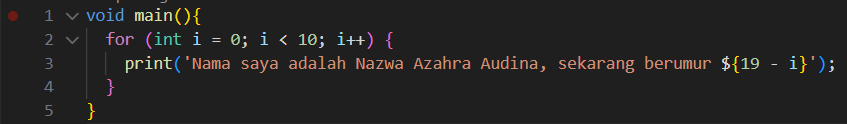
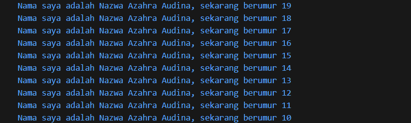
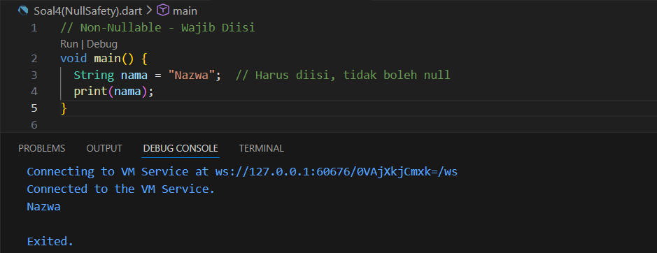
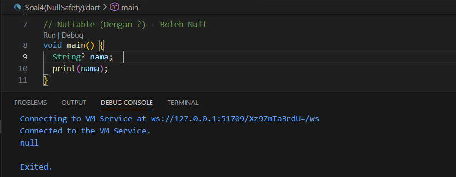
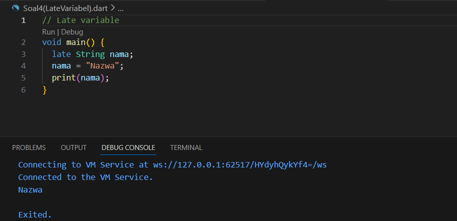

# Laporan Praktikum 02 : Pengantar Bahasa Pemrograman Dart - Bagian 1

Nama    : Nazwa Azahra Audina  
NIM     : 244107060146  
Absen   : 13  

## Soal 1
Modifikasilah kode pada baris 3 di VS Code atau Editor Code favorit Anda berikut ini agar mendapatkan keluaran (output) sesuai yang diminta!

### Gambar Soal

---

### Output

## Soal 2
Mengapa sangat penting untuk memahami bahasa pemrograman Dart sebelum kita menggunakan framework Flutter ? Jelaskan!

### Jawaban
* Memahami bahasa pemrograman Dart sebelum menggunakan framework Flutter sangat penting karena Dart merupakan bahasa utama yang digunakan dalam pengembangan Flutter. Seluruh kode yang ditulis dalam Flutter pada dasarnya adalah kode Dart, sehingga pemahaman terhadap Dart akan memudahkan dalam memahami sintaks, struktur widget, serta konsep pemrograman berorientasi objek yang diterapkan di Flutter. Selain itu, penguasaan Dart juga membantu dalam proses debugging dan optimalisasi kinerja aplikasi.

## Soal 3
Rangkumlah materi dari codelab ini menjadi poin-poin penting yang dapat Anda gunakan untuk membantu proses pengembangan aplikasi mobile menggunakan framework Flutter.

### Jawaban
## - Object Orientation (OOP)
- Dart dirancang menggunakan konsep OOP.
- Objek menyimpan data (fields) dan kode (methods).
- Objek dibuat dari blueprint yang disebut class.
- Mendukung encapsulation, inheritance, abstraction, composition, dan polymorphism.

## - Operator Aritmatika
- `+` : tambah
- `-` : kurang
- `*` : kali
- `/` : bagi
- `~/` : pembagian bilangan bulat
- `%` : modulus (sisa bagi)
- `-expression` : negasi (membalik nilai)

** - Shortcut operator:**
- `+=`
- `-=`
- `*=`
- `/=`
- `~/=`

## - Operator Increment dan Decrement
- `++var` atau `var++` : menambah nilai variabel sebesar 1
- `--var` atau `var--` : mengurangi nilai variabel sebesar 1

## - Operator Equality dan Relational
- `==` : memeriksa apakah operan sama
- `!=` : memeriksa apakah operan berbeda
- `>` : operan kiri lebih besar dari operan kanan
- `<` : operan kiri lebih kecil dari operan kanan
- `>=` : operan kiri lebih besar atau sama dengan operan kanan
- `<=` : operan kiri lebih kecil atau sama dengan operan kanan

## - Operator Logical
- `!expression` : negasi (kebalikan), true jadi false, false jadi true
- `||` : logika OR
- `&&` : logika AND

## Soal 4
Buatlah penjelasan dan contoh eksekusi kode tentang perbedaan Null Safety dan Late variabel !

### Jawaban
### 1. Null Safety
Fitur yang memastikan variabel tidak boleh null kecuali memang diizinkan. Ada 2 jenis:

#### a. Non-Nullable (Tanpa ?)
- Variabel wajib diisi nilai awal.
- Jika tidak diisi, akan terjadi error.

**Contoh:**  

#### b. Nullable (Dengan ?)
- Variabel boleh bernilai `null`.
- Jika tidak diisi, nilainya otomatis `null`.

**Contoh:**

### 2. Late Variable
`late` digunakan untuk variabel non-nullable yang diinisialisasi (diisi nilainya) belakangan.

- Variabel tidak perlu langsung diberi nilai saat deklarasi.
- Namun wajib diisi sebelum digunakan.
- Jika digunakan sebelum diisi, akan terjadi runtime error.

**Contoh:**  

---

### Perbedaan Singkat

- Null Safety → Mengatur apakah variabel boleh bernilai `null` atau tidak.
- Late Variable → Menunda pemberian nilai pada variabel non-nullable.