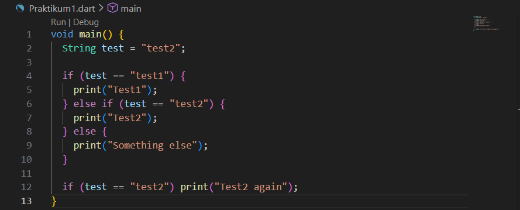
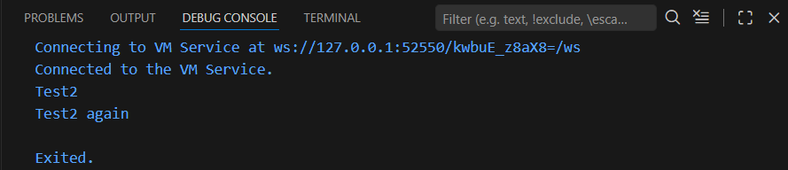

# Laporan Praktikum 03 : Pengantar Bahasa Pemrograman Dart - Bagian 2

Nama    : Nazwa Azahra Audina  
NIM     : 244107060146  
Absen   : 13  

## Praktikum 1 : Menerapkan Control Flows ("if/else")

1. Ketik atau salin kode program berikut ke dalam fungsi main(). 
 

2. Silakan coba eksekusi (Run) kode pada langkah 1 tersebut. Apa yang terjadi? Jelaskan! 
 
