# Laporan Praktikum 06 : Layout dan Navigasi

Nama    : Nazwa Azahra Audina  
NIM     : 244107060146  
Absen   : 13  

## Praktikum 1: Membangun Layout di Flutter
1. Langkah 1: Buat Project Baru 
 

2. Langkah 2: Buka file lib/main.dart 
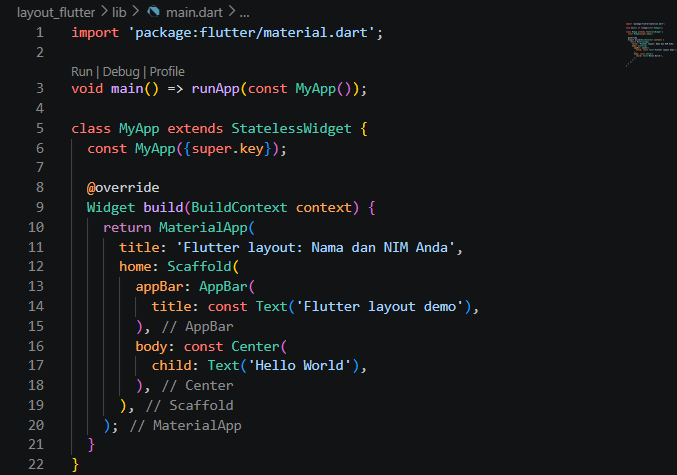 
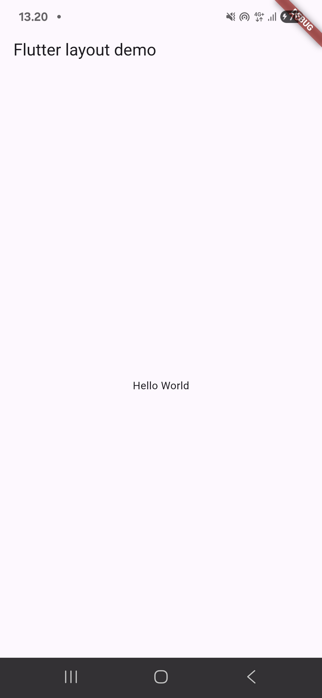 

3. Langkah 3: Identifikasi layout diagram  

4. Langkah 4: Implementasi title row 
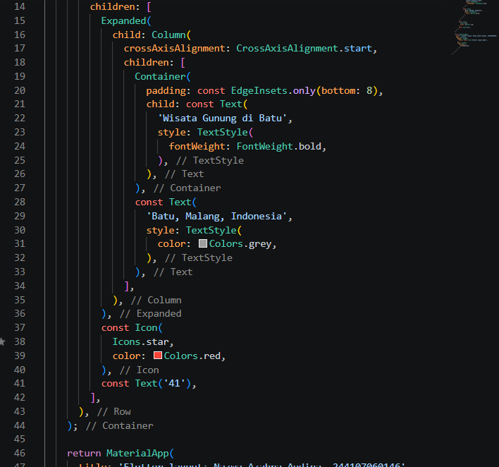 
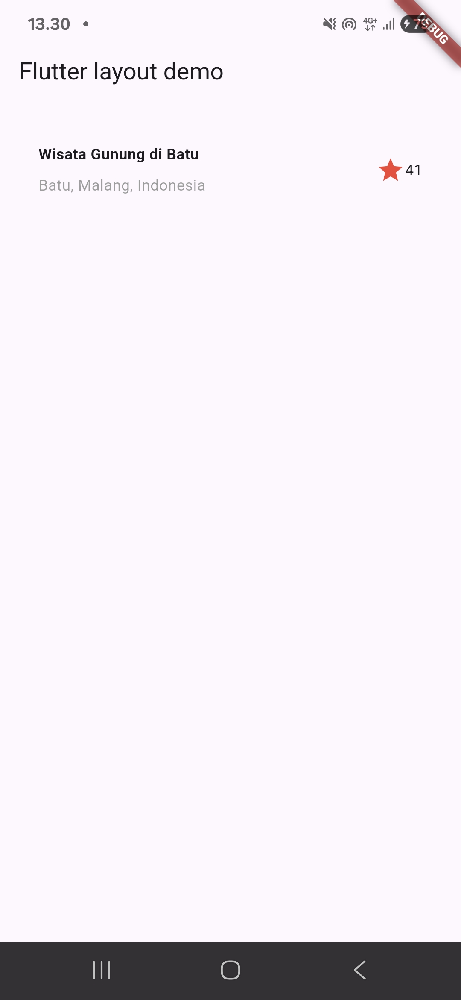 

## Praktikum 2: Implementasi button row
1. Langkah 1: Buat method Column _buildButtonColumn 
- lib/main.dart (_buildButtonColumn)  
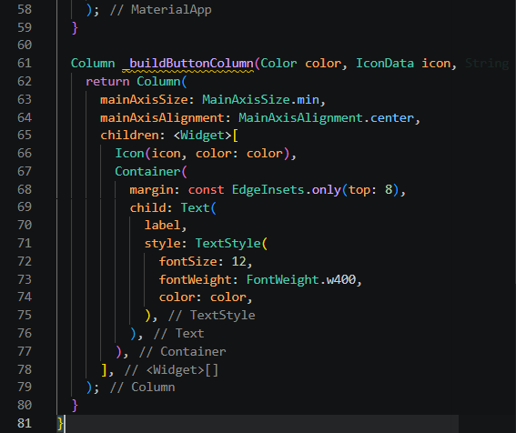 

2. Langkah 2: Buat widget buttonSection 
- lib/main.dart (buttonSection) 
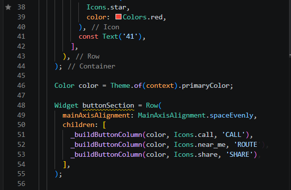 

3. Langkah 3: Tambah button section ke body 
- Tambahkan variabel buttonSection ke dalam body seperti berikut: 
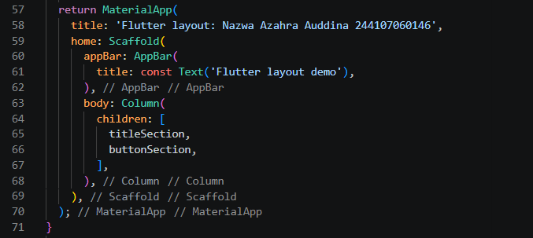 
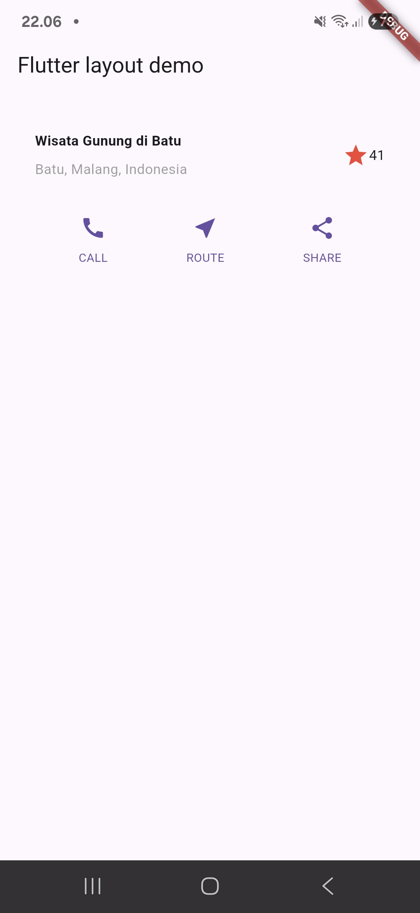 

## Praktikum 3: Implementasi text section
1. Buat widget textSection 
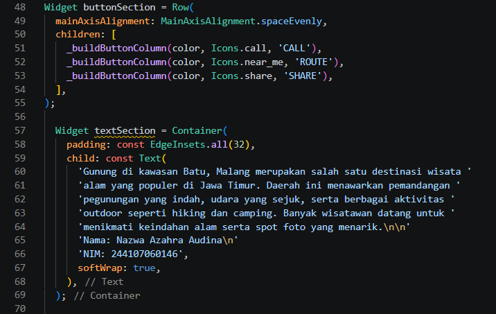 

2. Tambahkan variabel text section ke body 
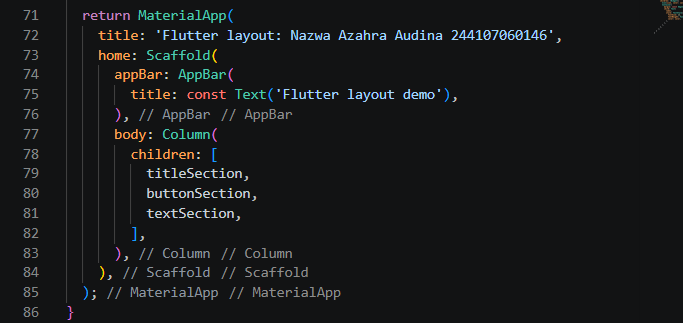 
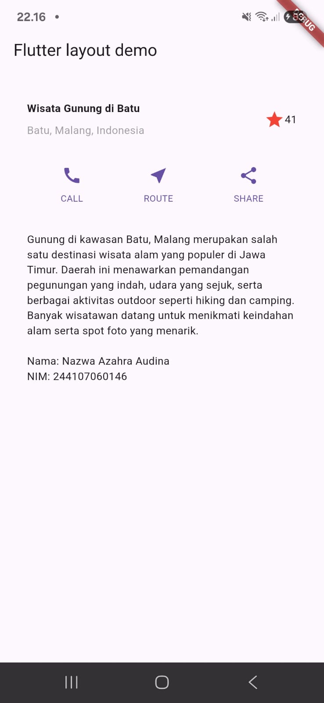 

## Praktikum 4: Implementasi image section
1. Langkah 1: Siapkan aset gambar 
- Isi file pubspec.yaml 
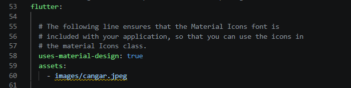 

2. Langkah 2: Tambahkan gambar ke body  
- Tambahkan aset gambar ke dalam body seperti berikut: 
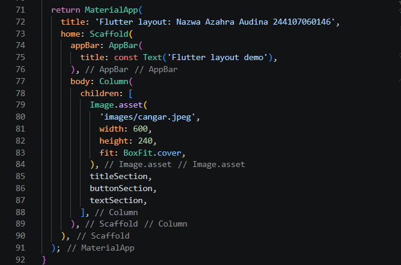 

3. Langkah 3: Terakhir, ubah menjadi ListView  
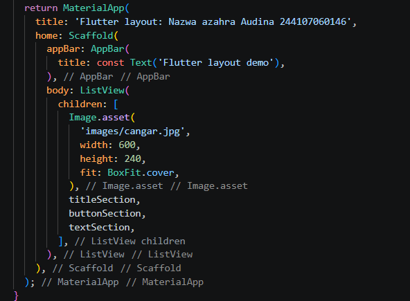 
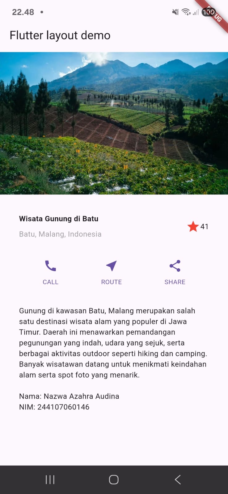 

## Tugas Praktikum 1
1. Selesaikan Praktikum 1 sampai 4, lalu dokumentasikan dan push ke repository Anda berupa screenshot setiap hasil pekerjaan beserta penjelasannya di file README.md!
2. Silakan implementasikan di project baru "basic_layout_flutter" dengan mengakses sumber ini: https://docs.flutter.dev/codelabs/layout-basics
- Tambah bagian grid untuk rekomendasi wisata lainnya  
 